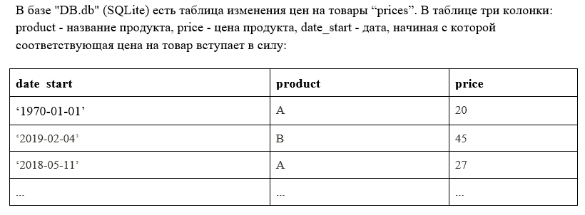
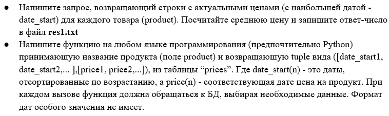
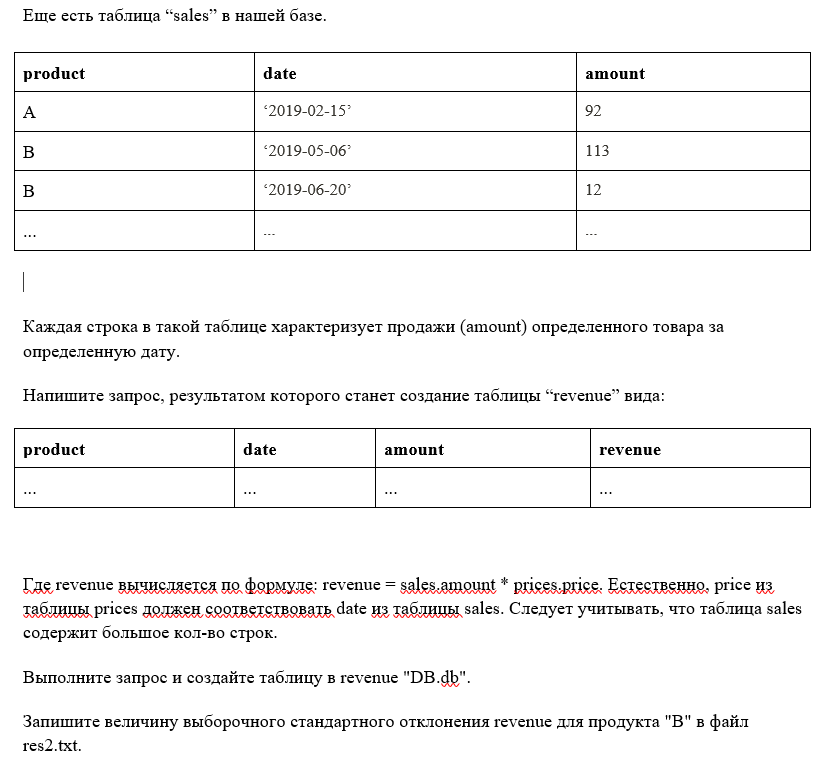
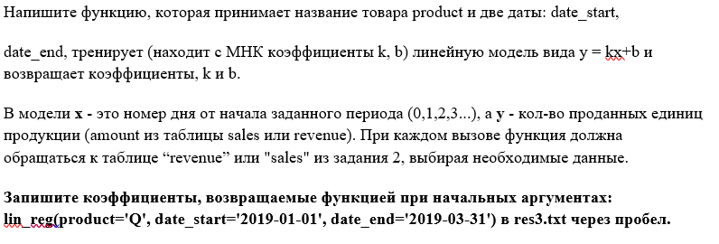

Final report
================
Kostas Spirliev
19 06 2020


### Введение

Работа над заданиями велась в R-studio и частично в HeidiSQL. Все отделы
этого отчета в начале будут снабжены выполняемым заданием. Посмотрим на
первое задание:

<kbd>
  
</kbd>

Подключаем базу данных к R, создаем ее копию для последующего
обновления:

``` r
# если необходимо:
# install.packages("RSQLite")
library(RSQLite)
library(DBI)

# подключаем базу данных к R
data_base <- dbConnect(SQLite(), "data_base/DB.db")

# cоздаем копию базы данных, которую будем впоследствии обновлять:
updated_data_base <- dbConnect(SQLite(), "results/updated_DB.db")
sqliteCopyDatabase(data_base, updated_data_base)
```

Посмотрим на таблицы скопированной базы данных:

``` r
dbListTables(updated_data_base)
```

    ## [1] "prices" "sales"

Таблиц в базе две: “prices” и “sales”. Теперь мы готовы решать задания.

### Задание 1

<kbd>
  
</kbd>

Посмотрим на поля в prices

``` r
dbListFields(updated_data_base, "prices")
```

    ## [1] "date_start" "product"    "price"

Считаем среднее самых актуальных товаров в таблице “price”:

``` sql
SELECT AVG(price) AS mean FROM (SELECT MAX(date_start), product, price FROM prices GROUP BY product) 
```

<div class="knitsql-table">

| mean    |
| :------ |
| 366.905 |

1 records

</div>

Записываем результат:

``` r
price_mean <- dbGetQuery(data_base, "SELECT AVG(price) AS mean FROM (SELECT MAX(date_start), product, price FROM prices GROUP BY product)")
write(price_mean[, 1], "results/res1.txt")
```

Создаем функцию, которая принимает название товара и создает лист с
отсортированными датами и соотвествующими ценами данного товара (к
сожалению в R нет объекта класса “tuple”: самое близкое по структуре –
это объект класса “list”):

``` r
my_func <- function(name) {
    prices <- dbGetQuery(updated_data_base, "SELECT * FROM prices")
    prices$date_start <- as.Date(prices$date_start)
    prices <- prices[order(prices$date_start),]
    prices <- prices[prices$product == name,]
    list(prices$date_start, prices$price)
}
```

Проверяем работу функции:

``` r
my_func("A")
```

    ## [[1]]
    ##  [1] "1970-01-01" "2010-01-21" "2010-08-17" "2010-11-02" "2012-08-27" "2012-12-06" "2013-01-11"
    ##  [8] "2013-05-02" "2013-05-08" "2013-11-01" "2014-08-30" "2015-12-29" "2016-05-04" "2016-08-14"
    ## [15] "2016-09-28" "2017-04-01"
    ## 
    ## [[2]]
    ##  [1]  297.79  164.68  558.58  127.08  352.13    0.35  100.61  120.50  260.19 1747.84   59.84  118.27
    ## [13]  550.62  339.35  210.19  111.23

``` r
my_func("W")
```

    ## [[1]]
    ##  [1] "1970-01-01" "2010-05-02" "2012-02-27" "2013-01-21" "2013-09-04" "2014-01-26" "2015-01-21"
    ##  [8] "2015-10-19" "2016-03-16" "2016-09-14" "2017-05-25" "2017-12-02" "2018-01-07" "2018-04-26"
    ## [15] "2018-08-17" "2018-11-09"
    ## 
    ## [[2]]
    ##  [1]  122.12   98.27  135.74  100.66  250.16   22.98  363.78 1138.60  208.67   34.69   60.18  471.34
    ## [13]  529.98   62.19  111.25   92.93

### Задание 2

<kbd>
  
</kbd>

Составляем SQL-запрос для создания переменной revenue (для меня это было
реально challengeble и очень интересно. Пару раз чуть ли не крашнулся
ноутбук :) )

``` sql
SELECT temp2.product, temp2.date, temp2.amount, prices.price * temp2.amount AS revenue 
FROM
    (SELECT sales.*, temp.date_start  
    FROM sales 
    JOIN
        (SELECT min(julianday(sales.date) - julianday(prices.date_start)) AS diff, sales.date, prices.date_start, sales.product 
        FROM prices 
        LEFT JOIN sales ON prices.product = sales.product 
        WHERE julianday(sales.date) - julianday(prices.date_start) >= 0
        GROUP BY sales.date, sales.product
        ORDER BY sales.product, sales.date DESC) AS temp ON sales.product = temp.product AND sales.date = temp.date) AS temp2
LEFT JOIN prices ON prices.product = temp2.product AND prices.date_start = temp2.date_start;
```

<div class="knitsql-table">

| product | date       | amount |  revenue |
| :------ | :--------- | -----: | -------: |
| A       | 2018-01-14 |      9 |  1001.07 |
| H       | 2013-11-08 |     20 |  4740.00 |
| H       | 2013-11-06 |      1 |   237.00 |
| P       | 2014-11-06 |     20 | 23250.40 |
| H       | 2016-05-30 |     26 |    85.02 |
| R       | 2015-10-29 |      2 |   198.12 |
| F       | 2017-08-25 |      6 |   961.86 |
| J       | 2015-04-14 |     12 |   876.24 |
| A       | 2015-05-14 |      5 |   299.20 |
| L       | 2011-08-26 |      0 |     0.00 |

Displaying records 1 - 10

</div>

Теперь записываем результат в базу данных:

``` sql
CREATE TABLE revenue AS
SELECT temp2.product, temp2.date, temp2.amount, prices.price * temp2.amount AS revenue 
FROM
    (SELECT sales.*, temp.date_start  
    FROM sales 
    JOIN
        (SELECT min(julianday(sales.date) - julianday(prices.date_start)) AS diff, sales.date, prices.date_start, sales.product 
        FROM prices 
        LEFT JOIN sales ON prices.product = sales.product 
        WHERE julianday(sales.date) - julianday(prices.date_start) >= 0
        GROUP BY sales.date, sales.product
        ORDER BY sales.product, sales.date DESC) AS temp ON sales.product = temp.product AND sales.date = temp.date) AS temp2
LEFT JOIN prices ON prices.product = temp2.product AND prices.date_start = temp2.date_start;
```

Проверим, что в базе данных теперь есть новая таблица revenue:

``` r
dbListTables(updated_data_base)
```

    ## [1] "prices"  "revenue" "sales"

Посчитаем стандартное отклонение revenue для продукта “B”:

``` r
revenue <- dbGetQuery(updated_data_base, "SELECT * FROM revenue")
sd(revenue[revenue$product == "B",]$revenue)
```

    ## [1] 33465.94

Запишем результат:

``` r
write(sd(revenue[revenue$product == "B",]$revenue), "results/res2.txt")
```

### Задание 3

<kbd>
  
</kbd>

Напишем функцию, возвращающую коэффициенты линейной регрессии: b -
значение revenue при series = 0 в модели и k - изменение revenue
при изменении series на 1 пункт. Переменная series – это ряд от 0, 1,
2, 3 до последнего дня (от date\_start до date\_end):

``` r
lin_reg <- function(product, date_start, date_end) {
    revenue1 <- revenue[revenue$product == product & 
                            revenue$date >= date_start & revenue$date <= date_end, ]
    revenue1 <- revenue1[order(revenue1$date), ]
    revenue1$series <- 0:(nrow(revenue1) - 1)
    result <- lm(revenue ~ series, revenue1)$coefficients
    names(result) <- c("b", "k")
    rev(result)
}
```

Проверяем функцию:

``` r
lin_reg(product='Q', date_start='2019-01-01', date_end='2019-03-31')
```

    ##          k          b 
    ##  -42.57668 7120.80683

Записываем результат:

``` r
write(lin_reg(product='Q', date_start='2019-01-01', date_end='2019-03-31'), "results/res3.txt")
```

Все задания выполнены :)
